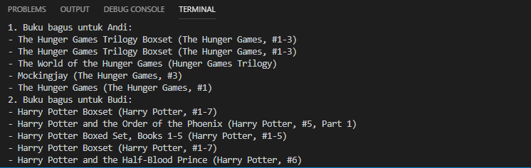

Repositori ini berisi pengerjaan untuk soal [ujian machine learning JCDS04](https://github.com/LintangWisesa/Ujian_MachineLearning_JCDS04) nomor 2.

Berdasarkan dataset yang diberikan, membuat sebuah sistem rekomendasi menggunakan metode *content based filtering*

Fitur yang digunakan untuk memfiltrasi adalah *author, original title, title, language code*

```py
features = books[['authors', 'original_title', 'title', 'language_code']]
features = features.fillna('None')
features['all'] = features['authors'] + ' ' + features['original_title'] + ' ' + features['title'] + ' ' + features['language_code']
```

Fitur-fitur teks tersebut kemudian dimasukkan ke dalam *bag of words* menggunakan metode CountVectorizer dari [scikit-learn]().

Bila seseorang memiliki buku favorit, menggunakan *cosine similarity* dapat ditemukan buku bacaan lain yang cocok untuk orang tersebut.

```py
from sklearn.metrics.pairwise import cosine_similarity
score = cosine_similarity(matrixFeature)
indexAndi = books[books['original_title'] == 'The Hunger Games'].index.values[0]
# print(indexAndi)
daftarScoreA = list(enumerate(score[indexAndi]))
# print(daftarScore)
sortDaftarScoreA = sorted(
    daftarScoreA,
    key = lambda j: j[1],
    reverse = True
)
# print(sortDaftarScore[1:6])
similarBooksA = []
for i in sortDaftarScoreA:
    if i[1] > 0.5:
        similarBooksA.append(i)
# print(similarBooks[1:6])
recommendA = random.choices(similarBooksA, k=5)
print('1. Buku bagus untuk Andi:')
for i in recommendA:
    print('-',
        books.iloc[i[0]]['title'],
        )
```

Terdapat lima pengguna yang memasukkan nama buku dan hasil pada terminal adalah sebagai berikut.


Selamat menikmati! 😊🍺